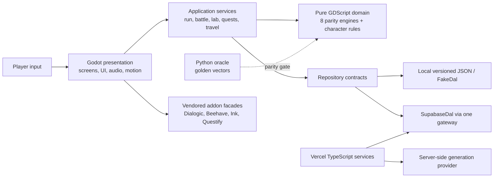
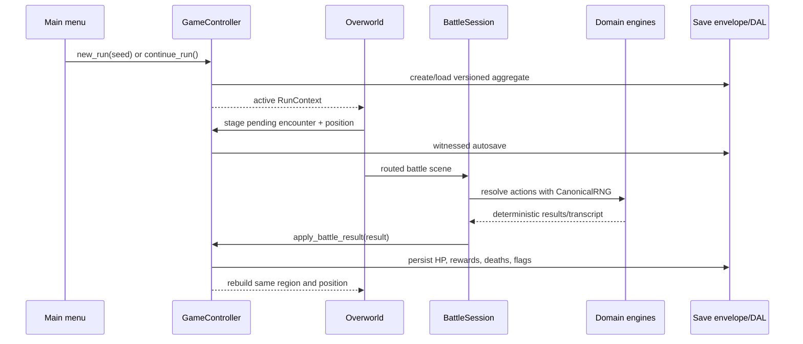

# Mutants Game — Project Architecture Blueprint

Generated: 2026-07-11
Scope: `main` at `57407ad`, plus the enterprise-hardening changes in the working tree
Detail level: implementation-ready

## 1. Executive architecture

Mutants Game is a deterministic desktop creature-collection RPG built as a layered Godot 4.7
application, backed by a Python rules oracle, an optional Supabase persistence service, and a small
Vercel/TypeScript service boundary. The design is a modular monolith: gameplay runs in one Godot
process, while deterministic math, application orchestration, infrastructure adapters, and visual
presentation are kept in explicit folders with automated dependency guardrails.

The governing rule is simple: **the Python oracle defines gameplay outcomes; the Godot domain port
must reproduce it; presentation may make the result feel alive but may not invent outcome math.**



## 2. Repository and technology map

| Area | Responsibility | Primary technology |
|---|---|---|
| `client/` | Shipped desktop game | Godot 4.7, typed GDScript |
| `client/domain/` | Pure deterministic outcome engines | RefCounted GDScript only |
| `client/application/` | Use cases and run orchestration | GDScript services/controllers |
| `client/infrastructure/` | DAL, catalogs, input, worldgen, addon/network seams | GDScript adapters |
| `client/presentation/` | Screens, animation, audio, narrative rendering, visual identity | Godot Control/Node2D |
| `oracle/` | Canonical reference engines | Python 3.12 |
| `tools/` | Catalog, seed, constants, art/audio and validation pipelines | Node.js and Python |
| `services/` | Privileged generation and succession endpoints | TypeScript, Vitest, Vercel |
| `supabase/` | Schema, RLS, seed, pgTAP proofs | PostgreSQL/Supabase |
| `docs/` | Normative design, content, ADRs, realization plan | Markdown/CSV/JSON |

## 3. Layer boundaries

### Domain

`client/domain/` owns stat, level, lab, battle, skill, status, loot, character, constants, and the
canonical RNG port. Domain scripts extend `RefCounted`; CI rejects Node inheritance, addon imports,
wall-clock reads, and global random calls. Domain functions accept plain values and an injected
`CanonicalRNG`, and return plain values.

New numerical mechanics must follow this order:

1. Define or ratify the behavior in the Python oracle.
2. Add/update golden vectors and generated constants.
3. Port the behavior to typed GDScript.
4. Add parity tests before presentation uses it.

### Application

`client/application/` owns transactions across domain objects and persisted run state. Important
aggregates and services include:

- `RunContext`: the in-memory/save aggregate.
- `GameController`: run lifecycle, save/continue, battle handoff, system accessors.
- battle and skill-battle sessions/controllers, capture, kits, loot, leveling, mortality;
- lab legality, recipes, operation purpose streams;
- quests, Ink bridge, endings, region travel, encounter direction, AI blackboards.

Application code may mutate the run aggregate, but it must delegate outcome math to domain engines.

### Infrastructure

Infrastructure turns external formats into application contracts:

- catalog loaders expose generated JSON/Resource data;
- `FakeDal` and `SupabaseDal` implement repository contracts;
- `SupabaseGateway` is the only project seam that touches the vendored Supabase addon;
- world generation persists pure layouts and rebuilds presentation from them;
- `InputService` owns contexts and remapping;
- service API adapters keep privileged keys outside the client.

Repository base methods deliberately fail loudly. Production and test implementations must override
the complete contract; direct use of a base repository is an integration error.

### Presentation

Presentation owns feel and legibility: the screen router, grimoire theme, motion, audio, dialogue,
HUDs, creature plates, lab ritual, battle stage, world dressing, toasts, and accessibility settings.
Presentation randomness is local and cosmetic; it must never consume canonical gameplay streams.

## 4. Runtime flow



## 5. Data architecture

`RunContext` is the aggregate boundary. It carries run identity/version, act/rank, morality axes,
notoriety/deeds/corruption, currencies, party, inventory, world state, region unlocks, faction state,
flags, and narrative state. `SaveEnvelope` supplies versioning and integrity checks; migrations adapt
old payloads. Save ordering is explicit and the ordinal ledger chooses the newest valid record.

Catalog data follows ADR-006 single-source generation:

```text
docs CSV/JSON sources
       ↓ generators
client catalog JSON + Godot Resources
       ↓ parity checks
supabase seed.sql
```

Current catalog count is 406 seedable species. Every species has an `art_ref`, but only 54 species
currently have promoted flat/cutout plates in `client/assets/creatures/manifest.json`; the remaining
352 resolve through fallback presentation and remain a production-art gap.

## 6. Narrative and content architecture

- Dialogic renders character/timeline presentation.
- Ink evaluates authored branching where used.
- QuestService owns ordered quest state and rewards.
- `DialogicFacade` is the only project-facing Dialogic seam.
- `OverworldChoices` routes branch tags to data-defined effects.
- `OverworldQuestsGlue` applies effects to the actual persisted run.

Morality events are now a domain-owned authored table. Quest effects emit `character_event` ids;
`CharacterEngine.apply_event` clamps axes, advances rank/deeds/notoriety, latches thresholds, and
returns pure state. This keeps the nine-god ending grid connected to actual choices.

## 7. AI architecture

Combat AI uses a canonical blackboard/RNG path and must remain replayable. Beehave is limited to
ambient presentation critters, where nondeterministic motion cannot change gameplay outcomes. The
vendored Beehave runtime is patched so editor metrics/debugger autoloads are optional; release builds
do not ship those globals.

## 8. Cross-cutting concerns

### Error handling and resilience

- absent optional cloud configuration starts offline without a launch-time error;
- save corruption produces an in-world “illegible ledger” state;
- missing catalog/art entries use explicit fallbacks;
- service inputs use Zod and contract tests;
- repository conflicts return typed `SaveResult` outcomes;
- capture tooling fails on output-directory/image-write errors.

### Security

- privileged keys stay in server-side service environments;
- the client may only receive public/anonymous Supabase configuration;
- RLS is default-deny and proved with pgTAP when database paths change;
- CI includes deterministic secret scanning;
- schema changes are migrations, never ad-hoc DDL.

### Observability

- LimboConsole is dev-build gated;
- battle and lab parity probes report stable hashes plus unambiguous `PARITY_OK`/`PARITY_DRIFT`;
- capture output provides windowed visual evidence;
- save outcomes are surfaced to players through the themed notification path.

### Accessibility and settings

Input contexts, keyboard/gamepad focus, rebinding, reduce-motion behavior, battle speed, and audio
buses are centralized. Any new animated surface must offer an instant/headless path and honor
reduce-motion.

## 9. Testing architecture

The verified 2026-07-11 baseline contains 100 GdUnit suites and 609 test cases. The complete test stack is:

- GDScript format/lint and domain/AI purity gates;
- 609 Godot unit, integration, parity, screen, and end-to-end tests;
- Python constants/RNG/golden/splice/balance checks;
- JS catalog parity and asset-contract checks;
- TypeScript typecheck and 37 service contract tests;
- SQLFluff plus conditional Supabase reset/pgTAP/anon-isolation tests;
- windowed OpenGL capture of menu, overworld, party, lab, and battle.

Expected negative-path tests currently emit some Godot error lines (corrupt save, missing route). Test
success must be read from the XML report, not by treating every `ERROR:` string as a failed assertion.
Godot/GdUnit shutdown still reports ObjectDB/resource retention after broad suites; this is a known
diagnostic debt and should be isolated by suite/addon before calling the build leak-clean.

## 10. Deployment architecture

The client exports a Windows x86-64 desktop build through `client/export_presets.cfg`. Tests and
GdUnit are excluded from the export. Services deploy independently to Vercel; Supabase owns the data
plane. Runtime configuration must be injected per environment and never committed.

Release gates should run in this order:

1. generators and drift check;
2. lint and purity checks;
3. oracle/parity/balance checks;
4. service typecheck/tests;
5. full Godot import and 609-case suite;
6. database/RLS tests when Supabase changed;
7. windowed capture and visual review at 1600×900 and 1280×720;
8. Windows release export and smoke launch.

## 11. Extension patterns

### Add a gameplay mechanic

Start in the oracle, create golden vectors, port to domain, wrap in an application service, then add
presentation. Never begin with a UI-side formula.

### Add a quest or choice

Add the content definition and timeline, reference an existing authored effect/event id, let the
generic quest dispatch apply it, and add a headless branch test plus persistence assertion.

### Add a region

Add catalog identity/force, worldgen data, terrain palette, cast definitions, encounter/boss data,
and authored quest routing. Verify deterministic layout, reachable spawn, structure occupancy, travel,
art identity, and a windowed capture.

### Add an external integration

Create one infrastructure gateway, expose plain data through a repository/service contract, provide a
fake, and test both implementations against the same contract. Do not leak addon/SDK types upward.

### Add visual polish

Use existing palette/theme services, honor reduce-motion, keep HUD above fullscreen effects, cache
generated textures, supply a headless no-op, and capture the result. A screenshot is evidence of
composition—not evidence of gameplay correctness—so both visual and behavioral tests are required.

## 12. Architectural decisions and consequences

| Decision | Consequence |
|---|---|
| Python oracle is law | Determinism is reviewable; mechanic changes require a deliberate parity pipeline. |
| Modular monolith client | Fast iteration and simple deployment; layer rules need CI enforcement. |
| Local-first runs | Core game remains playable offline; cloud sync can stay optional. |
| Data-driven content | Large authored arcs can ship without per-quest screen code. |
| Vendored addons behind facades | Integration risk is localized; vendor patches must be documented and regression-tested. |
| Presentation-local randomness | The world can feel alive without corrupting replay streams. |
| Programmatic UI plus shared theme | Rapid consistent screens; complex surfaces need screenshot review to avoid “debug form” layouts. |

## 13. Current risk register and next execution order

1. **Creature art completeness:** promote/QA the remaining 352 catalog plates before promising unique
   art for every encounter.
2. **Overworld cohesion:** the cast is now smaller and more dispersed and Verdant paths are biome-
   coherent, but terrain plates still show hard square boundaries and need an autotile/blend pass.
3. **Lab presentation:** legality is robust; composition still reads as a long form and needs a staged
   ritual layout with stronger reagent affordances and compact information hierarchy.
4. **Shutdown retention:** isolate ObjectDB/resource retention by running addon groups separately,
   then fix ownership/disconnect/free paths until windowed capture exits cleanly.
5. **Cloud productionization:** the DAL exists, but atomic insert conflict semantics and live cloud-save
   product behavior need an explicit release phase.
6. **README/status drift:** phase reports are historical evidence, not current status; ongoing releases
   should maintain one current verification ledger.

This blueprint should be updated whenever a layer boundary, canonical data source, integration seam,
or release gate changes.
